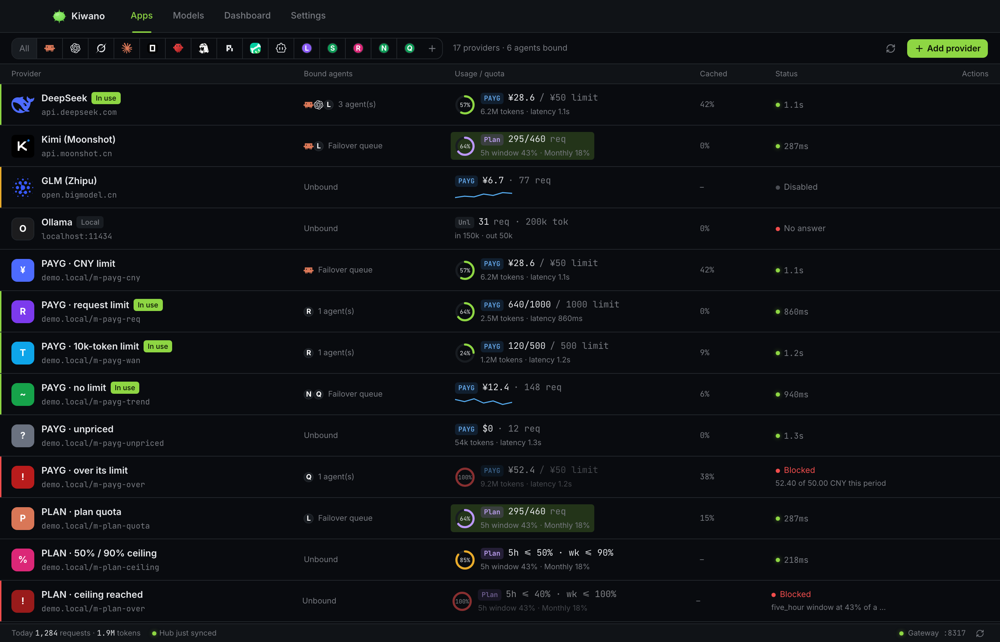

<div align="center">
  
  <h1>Kiwano</h1>
  <p><strong>Local-first AI provider manager.</strong><br/>
  Keep every provider key on your own machine, point all your coding agents at one local gateway, and see what they actually cost.</p>
  <p>
    <a href="https://github.com/lightconsen/kiwano/releases/latest"></a>
    <a href="https://github.com/lightconsen/kiwano/actions/workflows/ci.yml"></a>
    
  </p>
</div>

Kiwano is a desktop app that sits between your coding agents and your AI providers. You register providers once, it runs a local gateway on `127.0.0.1:8317`, and every agent — Claude Code, Codex and others — talks to that one port. The gateway normalizes protocols, routes each request through the strategy you picked, meters what it cost, and records what happened.

Your keys stay on your machine, in an owner-only local database. Requests never touch a Kiwano server.

**30-second demo: https://youtu.be/M0pO79Wlx-s**



> Captured from the development build with its bundled sample data set.

## Features

- **Provider management** — add, edit, switch and delete provider configs. Route with `single`, `failover`, `roundrobin`, `timewindow` or `quota` strategies, each with its own candidate weights and windows. Under any strategy but `single`, a request that fails is replayed against the next candidate instead of being handed back as your problem.
- **Agent takeover** — connect Claude Code, Codex, Gemini CLI, Grok Build, Claude Desktop, OpenCode, OpenClaw, Hermes, Pi, WorkBuddy, CodeBuddy Code, Kimi Code CLI, Qwen Code and Cline to the local gateway in one click. Each agent's original config is backed up and restored when you switch it off.
- **Local gateway** — one always-on port, and protocol normalization (anthropic / openai) so an OpenAI-compatible provider can serve Claude Code. Gemini CLI's native API is forwarded as a third protocol, passed through rather than translated, so it reaches Google unchanged while the gateway meters it. Hot-reloads on change; the daemon outlives the GUI, and a stream that stalls is abandoned with an error rather than left to hang.
- **Usage and cost** — trends for requests and tokens over today, 7, 30 days or all time, attributed per provider and per agent, with quota rings for metered plans and per-period cost alerts. Each stat compares the window with the one before it, and the numbers refresh the moment a request lands — no clicking to see what just happened.
- **Models shelf** — the Kiwano Hub catalog of 24 providers (23 first-party, plus the OpenRouter aggregator), with live search and one-click add. It syncs conditionally: a manifest hash skips the download when nothing changed, and what it fetched is cached locally, so the shelf keeps working offline once it has synced.
- **Request logs** — every gateway request with status, latency and token accounting; filter down to errors.
- **cc-switch import** — `kiwano import cc-switch` reads an existing cc-switch configuration and migrates it in. It reuses a provider already here for the same endpoint, and never moves an agent off a route you have since chosen.
- **Agent intelligence (opt-in)** — `kiwano insights` builds a per-agent scorecard — cache hit rate with writes in the denominator, median session context growth, reasoning share, retries — and flags findings tagged `cache` / `bloat` / `retry` / `overhead`, each carrying the request-log rows behind it. Tuning advice finds a provider whose error rate dwarfs its siblings, and rule injection writes picked findings back into each agent's own `CLAUDE.md` / `AGENTS.md`. Over MCP, an agent can query its own usage. All of it sits behind the Features panel: opt-in, reversible, and none of it changes a route without you.
- **A conversation keeps its provider** — under quota and timewindow, a switch applies to the *next* conversation; one already running finishes where it is, instead of rebuilding a prompt cache its provider has already charged for. Requests that name no session are chosen afresh, as they were before.
- **Money ceilings in the currency being spent** — an agent's limit is written in a currency its providers actually bill in, never in your display preference. Spending in another currency is converted at the Hub's rates before it counts; the ceiling itself is never converted.
- **Self-update** — signed releases (minisign); the app checks at startup and updates in place. 0.1.2 and later update themselves to newer versions.

## How it compares

| | Kiwano | cc-switch | LiteLLM / a hosted gateway |
| --- | --- | --- | --- |
| Shape | Desktop app + local gateway + CLI | Switches Claude Code's config | Always-on server |
| Agents covered | 14, taken over in one click and restored | Mainly the Claude Code ecosystem | Only clients you wired up yourself |
| Local-first | Everything on your machine, no telemetry | Local | Keys live on the server |
| Routing | 5 strategies; a failed request replays against the next candidate | Switches, does not route | Depends on the implementation |
| Cost metering | Per provider × per agent, with quota rings and alerts | No | Usually |

cc-switch answers "which provider am I on"; Kiwano answers "how do I manage every provider and every agent, and what are they costing me". The first is a subset of the second — `kiwano import cc-switch` migrates an existing configuration across, so moving over costs one command.

## Download

Latest release: **https://github.com/lightconsen/kiwano/releases/latest**

| Platform | File |
| --- | --- |
| macOS — Apple Silicon (M series) | [`Kiwano_aarch64.dmg`](https://hub.kiwano.cc/releases/Kiwano_aarch64.dmg) |
| macOS — Intel | [`Kiwano_x64.dmg`](https://hub.kiwano.cc/releases/Kiwano_x64.dmg) |
| Windows — installer | [`Kiwano_x64-setup.exe`](https://hub.kiwano.cc/releases/Kiwano_x64-setup.exe) |
| Windows — MSI | [`Kiwano_x64_en-US.msi`](https://hub.kiwano.cc/releases/Kiwano_x64_en-US.msi) |
| Linux — AppImage | [`Kiwano_amd64.AppImage`](https://hub.kiwano.cc/releases/Kiwano_amd64.AppImage) |
| Linux — Debian / Ubuntu | [`Kiwano_amd64.deb`](https://hub.kiwano.cc/releases/Kiwano_amd64.deb) |
| Linux — Fedora / RHEL | [`Kiwano-1.x86_64.rpm`](https://hub.kiwano.cc/releases/Kiwano-1.x86_64.rpm) |

Those links are served from Cloudflare R2 and always point at the newest build — no version in the URL, so they stay valid across releases. The same files are attached to every [GitHub release](https://github.com/lightconsen/kiwano/releases) as a mirror.

**macOS builds are signed with a Developer ID and notarized**, so the app opens the usual way. Pick the build for your chip: `aarch64` is Apple Silicon, `x64` is Intel (it runs under Rosetta, but the updater expects the build matching your chip).

**Windows builds are not code-signed yet.** SmartScreen will warn on first launch; choose **More info → Run anyway**.

**Linux** — `chmod +x` the AppImage, or install the `.deb` / `.rpm` with your package manager. The Linux builds need **glibc 2.35+** (Ubuntu 22.04+, Debian 12+, Fedora 36+); the desktop app additionally runs on webkit2gtk 4.1, which is what sets that floor — the installer checks glibc before it downloads anything. Ubuntu 20.04 and older: the CLI and gateway build from source (`cargo build --release -p kiwano -p kiwanod`); the desktop app does not, because 20.04 has no webkit2gtk 4.1 to link against.

### Verify your download

Every release attaches `SHA256SUMS`, and every artifact carries a signed build-provenance attestation.

**Provenance** — proves the file was built by this repository's release workflow at the tagged commit, not merely that it is intact. It is checked against GitHub's transparency log, so it does not depend on trusting the host you downloaded from:

```sh
gh attestation verify Kiwano_x64.dmg --repo lightconsen/kiwano
```

**Checksum** — compare the digest in `SHA256SUMS` (attached to the [GitHub release](https://github.com/lightconsen/kiwano/releases)) with the file you have:

```sh
# the published digest
grep ' Kiwano_x64.dmg$' SHA256SUMS
# the digest of the file you have
sha256sum Kiwano_x64.dmg                    # Linux
shasum -a 256 Kiwano_x64.dmg                # macOS

# Windows, for Kiwano_x64-setup.exe
certutil -hashfile Kiwano_x64-setup.exe SHA256
```

The two lines must match. Note that `SHA256SUMS` records the GitHub release names, which carry the version; the R2 links above deliberately have none, so pair it with the matching GitHub release if you downloaded from R2. Provenance is the check that needs no name to line up.

Updates are delivered as `*.app.tar.gz` / `*-setup.exe` / `AppImage` artifacts from the release manifest (`latest.json`), signature-checked against the public key compiled into the app.

## Privacy

Kiwano is local-first by design, and the code is the specification:

- API keys are stored **locally, in an owner-only SQLite database** — directory `0700`, file `0600` — so only your user can read them. Provider credentials are only ever sent to the provider you configured.
- Requests, prompts and responses **never pass through a Kiwano server** — the gateway runs on your machine.
- Usage history lives in a **local SQLite database** (`~/.kiwano/kiwano.db`). Nothing is uploaded.
- The Hub only ever serves **catalog metadata** (provider names, endpoints, prices). It sees no keys and no request data.
- There is no analytics or telemetry in the app. Update checks are a plain HTTPS request for a static JSON manifest.

## On a server

No display, no desktop app — one command:

```bash
curl -fsSL https://hub.kiwano.cc/install.sh | sh
```

It downloads the command-line client and the gateway daemon, checks the download
against a digest published for the release, installs both to `~/.local/bin`, and
registers the gateway as a **service for your own user** — no root. That last
part is not just convenience: `kiwano agents takeover` rewrites an agent's config
under its own `$HOME`, so the CLI and the agent have to be the same account, and
a user-level service is the layout where they are.

Prefer to read it first? It is a plain script —
[`packaging/install.sh`](packaging/install.sh) in this repo, served unmodified.

Every release also carries the same thing as a tarball — `kiwano-<target>.tar.gz`,
with the binaries, a systemd unit and [`INSTALL.md`](packaging/INSTALL.md) — and
it is attested like every other artifact:

```bash
gh attestation verify kiwano-x86_64-unknown-linux-gnu.tar.gz --repo lightconsen/kiwano
tar xzf kiwano-x86_64-unknown-linux-gnu.tar.gz -C /tmp/kiwano
# then follow /tmp/kiwano/INSTALL.md
```

The CLI does everything the app does that is not inherently graphical: add
providers, choose a routing strategy, take an agent over (which is what makes a
server usable — the gateway only routes keys it minted itself, so an agent
pointed at the port by hand is refused), read the logs, export the config. See
[`docs/cli.md`](docs/cli.md) for the full command reference.

### Monitoring the gateway

The data plane (`127.0.0.1:8317`) carries two read-only endpoints outside the
agent-key gate, for the tools that cannot hold the app's credentials: `GET
/health` (liveness for a supervisor) and `GET /metrics` (Prometheus text
format, gauges for routed agents, route candidates, open breakers and usage
counts — never a key or a request body).

By default `/metrics` answers any local process, but the per-agent labels come
back **hashed**, so a scrape still distinguishes agents without naming them.
To see the full names and require auth, run the daemon with a token:

```bash
KIWANO_METRICS_TOKEN=<token> kiwanod
```

`/metrics` then serves `Authorization: Bearer <token>` (a Prometheus
`bearer_token` config) to that token alone and 401s everyone else — under
systemd, put the variable in the unit's `Environment=`. `/health` never
carries identifiers, so it is unchanged either way.

## Requirements

- macOS (Apple Silicon or Intel), Windows 10 or later, or Linux x86_64
- Rust **1.98.0** to build — pinned by `rust-toolchain.toml`, so `rustup` picks it up automatically
- Node 24 and pnpm 10 for the frontend

## Development

The frontend and the Tauri shell live under `app/`, so the pnpm commands run
from there while the cargo ones run from the repo root — the Rust workspace
root is still here, because `crates/` is part of it.

```bash
cd app
pnpm install
pnpm dev         # frontend dev server on :1420 (browser, mocked data)
pnpm tauri dev   # desktop app in dev mode (real SQLite + gateway sidecar)
pnpm build       # frontend typecheck + production build
```

```bash
cargo test --workspace --locked
cargo clippy --workspace --all-targets --locked -- -D warnings
cargo fmt --all -- --check
```

The app does not contain the gateway; it spawns it as a sidecar daemon, and the
two are built and shipped together. `pnpm tauri` builds the gateway for the host
before handing over to the CLI, so the first `pnpm tauri dev` on a clean tree
compiles it before the frontend starts. For a cross build, name the target:
`KIWANO_SIDECAR_TARGET=x86_64-apple-darwin pnpm tauri build`. At runtime
`KIWANO_GATEWAY_BIN` overrides which binary the app looks for.

The UI renders no remote content: provider logos come from a local registry
(`app/src/components/icons/`, pinned by `index.test.ts`), and Hub traffic goes
through the gateway, never the WebView. If remote content or remote logos are
ever added, configure the app CSP (`app.security.csp` in `tauri.conf.json`) and
sanitize icon input first — see the registry header comment.

**Run `pnpm build:sidecar` first on a fresh clone.** The gateway is declared as
an `externalBin`, and Tauri resolves that in `app/src-tauri/build.rs` — so a
missing sidecar fails `cargo clippy` and `cargo test` themselves, not just the
bundle step. `pnpm tauri dev` does it for you; the bare cargo commands do not.

CI runs exactly those four Rust checks on Linux and macOS, plus a frontend typecheck and build. The toolchain version is pinned in `rust-toolchain.toml` and in every workflow, so a new clippy release can't turn the build red on code nobody touched.

Layout:

| Path | What lives there |
| --- | --- |
| `app/src/` | React UI (screens, components, the `api/` layer) |
| `app/src-tauri/` | The Tauri shell: commands, tray, watchdog, updater — the desktop app's binary is `kiwano-app` |
| `crates/core/` | The application layer the app and the CLI share: view models, takeover, sync, share |
| `crates/gateway/` | The gateway daemon: routing, strategies, metering, store |
| `crates/adapters/` | Protocol conversion, agent config take-over, price lookup and cost calculation |
| `crates/cli/` | The `kiwano` command-line client ([docs](docs/cli.md)) |
| `packaging/` | The systemd unit and server install notes that ship inside the release bundle |
| `site/`, `design/` | Marketing site, and the original UI design prototype |

The desktop app is a thin Tauri shell over `kiwano-core`; the CLI is a second
front end over the same crate. That is deliberate — a provider added from the
command line is the same row, written the same way, as one added from the UI.

## Contributing

Bug reports with a reproduction and small focused pull requests are the most
useful things you can send — see [CONTRIBUTING.md](CONTRIBUTING.md) for the dev
setup and the four checks CI runs. Security issues go through
[SECURITY.md](SECURITY.md), never a public issue.

## License

GNU General Public License v3.0 or later, see [LICENSE](LICENSE).

Selected modules are ported from [cc-switch](https://github.com/farion1231/cc-switch) (MIT); ported files carry upstream declarations, see [THIRD-PARTY-NOTICES](THIRD-PARTY-NOTICES).
