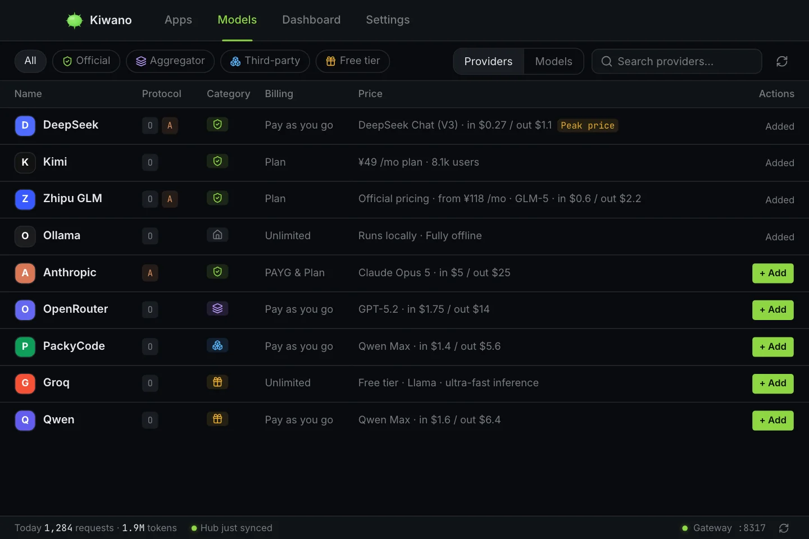
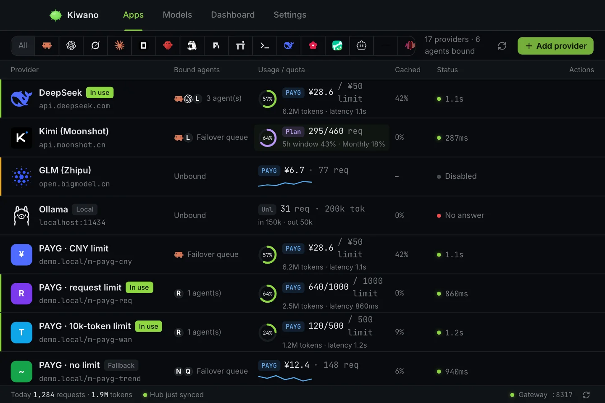
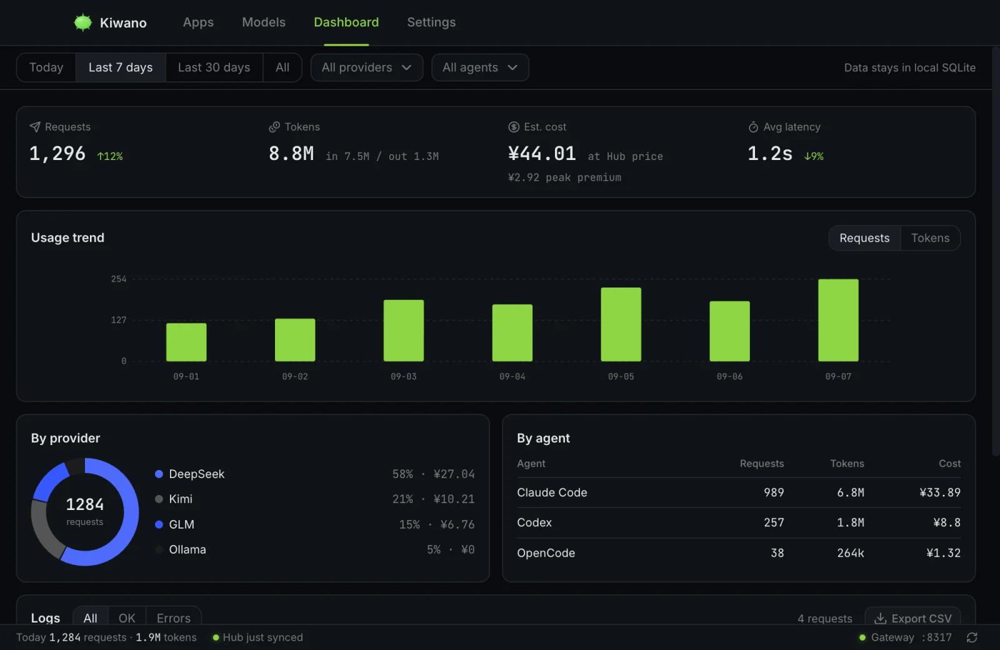

# はじめに

Kiwano はコーディングエージェントと AI プロバイダーの間に位置します。プロバイダーを
一度登録すれば、ローカルゲートウェイが `127.0.0.1` で動き、すべてのエージェントは
その 1 つのポートに接続します。本ページでは、インストールから最初の計測対象リクエスト
までを説明します。キーがマシンの外に出ることはありません。

## 必要なもの

- プロバイダーの API キー（OpenAI 互換または Anthropic 互換のエンドポイント）。
- インストール済みのコーディングエージェントが 1 つ以上 — Claude Code、Codex、
  Gemini CLI など（組み込みの 26個はすべて
  [エージェントの引き継ぎ](agent-takeover.ja.md)に一覧があります）。

## 1. インストールと起動

[Releases](https://github.com/lightconsen/kiwano/releases/latest) から自分の
プラットフォーム向けの署名済みビルド（macOS、Windows、Linux）をダウンロードします。
Homebrew を使っているなら `brew install` でもかまいません。初回起動で **デーモン**
——ローカルゲートウェイ——が立ち上がります。デーモンは GUI ウィンドウより長生きし、
アプリを閉じてもゲートウェイは動き続けます。トレイアイコンが稼働を示します。

## 2. プロバイダーの登録

**モデル**のカタログ（Hub カタログ）を開いてベンダーを検索します — DeepSeek、
Kimi、Zhipu GLM、OpenRouter など。あるいは **アプリ**画面で手動で追加します:

*モデルのカタログ——Hub カタログ。公式・アグリゲーター・サードパーティ・無料枠の
プロバイダーを、課金と価格つきで示します。*

1. **プロバイダーを追加** → 名前、エンドポイント、API キー、そのエンドポイントが話す
   プロトコル（`openai` または `anthropic`）。
2. 任意で、既定のモデル、課金の種類（従量課金、プラン、無制限）と支出上限を設定します。
3. 保存します。何かがそのプロバイダーに対して計測された時点で、行にヘルスが表示されます。

キーは所有者限定のローカルデータベースに保存されます。データは、あなたが指定した
エンドポイント以外のどこにも送信されません。

## 3. エージェントの引き継ぎ

**アプリ**画面では、対応しているエージェントがそれぞれ 1 枚のカードです:

*アプリ画面——プロバイダーと、そこに紐付いたエージェント。使用量・クォータ・
ヘルスは行に表示されます。*

- そのエージェントがすでにプロバイダーを設定済みなら、**Kiwano を有効にする**が
  その取り込みを提案します — 初日から上流はそのままで、経路だけがゲートウェイ経由
  （そして計測対象）になります。
- 引き継ぎスイッチは、エージェント自身の設定ファイルを書き換えてゲートウェイを
  指させます。元のファイルは先にバックアップされ、引き継ぎを切るとバイト単位で
  復元されます。エージェントの設定の他の部分は一切変わりません。

エージェントごとに何が書き換わるか、特殊な挙動を持つ少数のエージェントについては
[エージェントの引き継ぎ](agent-takeover.ja.md)の表を参照してください。

## 4. 動作確認

エージェントからプロンプトを送り（`claude "hi"`、あるいは普段使うプロンプトで）、
Kiwano の**リクエストログ**を開きます。リクエストが、その帰属（どのプロバイダーが
処理したか）、トークン、レイテンシ、推定コストとともに表示されるはずです。
ダッシュボードは同じ行をプロバイダー別、エージェント別、日別に集計します。

*ダッシュボード——7日間の推移をプロバイダー別・エージェント別に帰属。下のログ行は
展開すると 1 件のリクエスト全体を表示します。*

## 5. 複数プロバイダーのルーティング

1 エージェントに 1 プロバイダーが `single` ストラテジーです。エージェントのルートに
候補を複数バインドし、ストラテジー — `failover`、`roundrobin`、`timewindow`、
`quota`、`least-busy` — と、エージェントごとの支出上限を選びます。
[ストラテジー](strategies.ja.md)を参照してください。

## データの保存場所

| 内容 | 場所 |
| --- | --- |
| プロバイダー、ルート、使用量、バックアップ | ローカル SQLite（所有者限定）。デーモン経由で読み書き |
| エージェントの設定 | 各エージェント自身の `$HOME` 配下のファイル——引き継ぎの表を参照 |
| リクエストログと本文 | ローカル。保存期間は設定で変更可能 |

## アンインストール / 無効化

エージェントごとに引き継ぎを切る（設定はバックアップから復元されます）か、
プロバイダーを削除します（次の候補が自動的に昇格します）。デーモンはトレイから
停止できます。死んだポートを指したままになるエージェントはありません — 外した
引き継ぎは復元され、バックアップが失われている場合は、ループバック URL ではなく
エージェント自身の既定に降格します。
