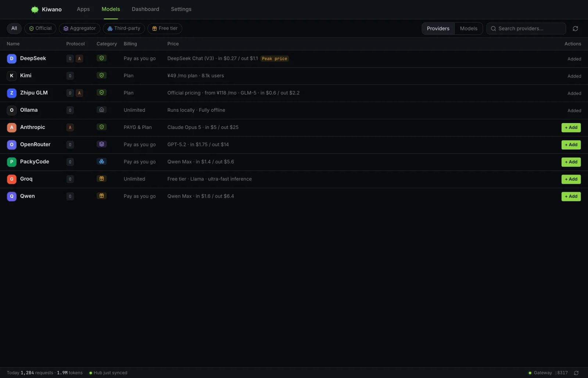
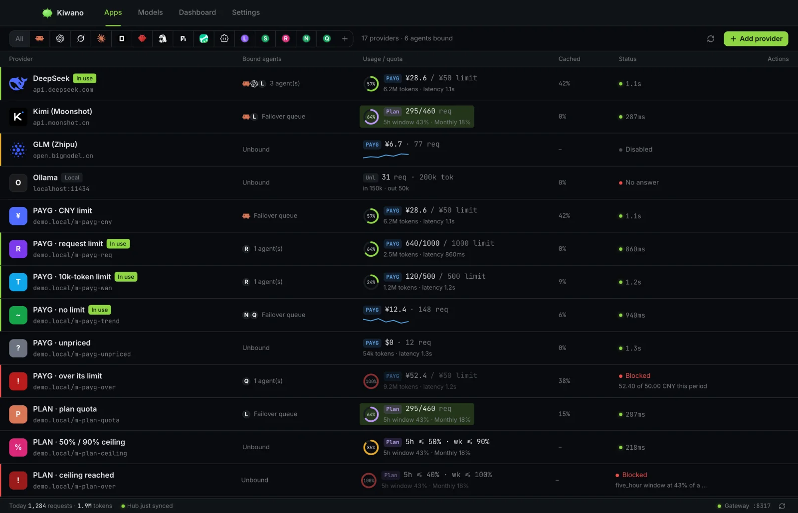
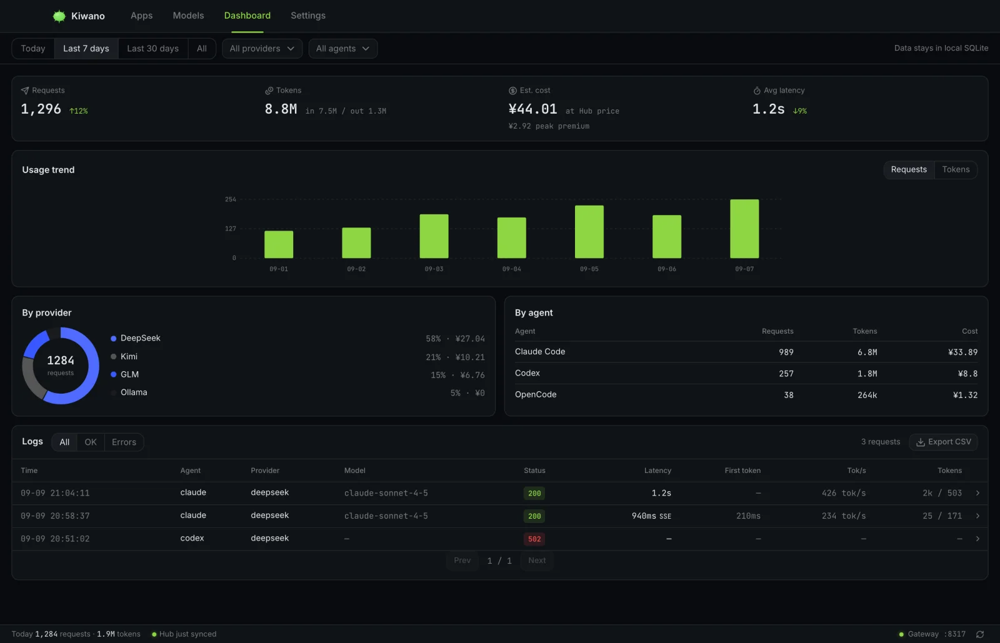

# Getting started

Kiwano sits between your coding agents and your AI providers: you register
providers once, it runs a local gateway on `127.0.0.1`, and every agent talks
to that one port. This page takes you from install to the first metered
request. Keys never leave your machine.

## What you need

- A provider API key (OpenAI-compatible or Anthropic-compatible endpoint).
- One or more installed coding agents — Claude Code, Codex, Gemini CLI, …
  (all 22 built-ins are listed in [Agent takeover](agent-takeover.md)).

## 1. Install and launch

Download the signed build for your platform from
[Releases](https://github.com/lightconsen/kiwano/releases/latest) (macOS,
Windows, Linux) or `brew install` if you use Homebrew. The first launch
starts the **daemon** — the local gateway — which outlives the GUI window:
closing the app leaves the gateway serving. A tray icon shows it is up.

## 2. Register a provider

Open the **Models** shelf (the Hub catalog) and search a vendor — DeepSeek,
Kimi, Zhipu GLM, OpenRouter, … — or add one manually on the **Apps** screen:

*The Models shelf — the Hub catalog: official, aggregator, third-party and
free-tier providers with their billing and prices.*

1. **Add provider** → name, endpoint, API key, and the protocol the endpoint
   speaks (`openai` or `anthropic`).
2. Optionally set a default model, a billing kind (pay-as-you-go, plan, or
   unlimited) and a spend limit.
3. Save. The provider row shows its health the moment anything is measured
   against it.

Your key is stored in an owner-only local database. Nothing is sent anywhere
except to the endpoint you named.

## 3. Take over an agent

On the **Apps** screen each supported agent is a card:

*The Apps screen — providers with their bound agents; usage, quota and health
live on the row.*

- If the agent already has a provider configured, **Enable Kiwano** offers to
  import it — the agent's upstream stays the same on day one, just routed
  (and metered) through the gateway.
- The takeover switch rewrites the agent's own config file to point at the
  gateway. The original is backed up first and restored byte-for-byte when
  you switch the takeover off. Nothing else in the agent's config changes.

What exactly is rewritten per agent — and the few agents with special
behavior — is the [Agent takeover](agent-takeover.md) table.

## 4. Verify

Send a prompt through the agent (`claude "hi"`, or any prompt you would
normally run), then open **Request logs** in Kiwano. You should see the
request with its attribution (which provider served it), tokens, latency and
estimated cost. The Dashboard aggregates the same rows by provider, by agent
and by day.

*The Dashboard — 7-day trends attributed per provider and agent; the log rows
below open into the full request.*

## 5. Route more than one provider

One provider per agent is the `single` strategy. Bind more candidates to an
agent's route and pick a strategy — `failover`, `roundrobin`, `timewindow`,
`quota` or `least-busy` — plus per-agent spend ceilings. See
[Strategies](strategies.md).

## Where things live

| What | Where |
| --- | --- |
| Providers, routes, usage, backups | local SQLite (owner-only), via the daemon |
| Agent configs | each agent's own file under `$HOME` — see the takeover table |
| Request logs and bodies | local, retention configurable in Settings |

## Uninstalling / switching off

Switch the takeover off per agent (config restored from backup) or delete a
provider (its next candidate is promoted automatically). The daemon can be
stopped from the tray; no agent is left pointing at a dead port — a takeover
you remove is restored, and one whose backup is gone is degraded to the
agent's own defaults rather than a loopback URL.
