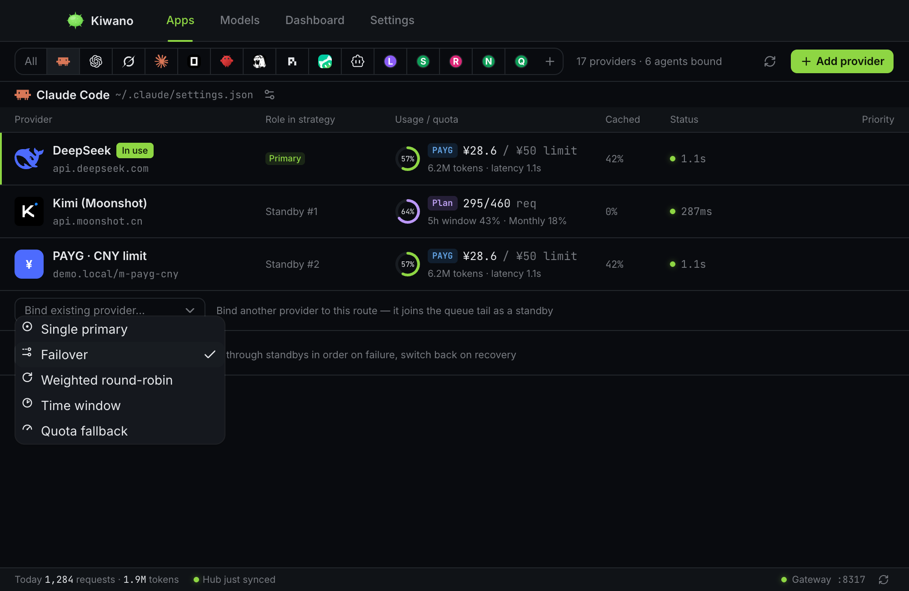

# Strategies and limits

Every agent routes through an ordered candidate queue — the providers bound
to it. A **strategy** decides which candidate serves the next request; the
rest of the queue is the replay order if that attempt fails mid-flight. This
page covers the strategies, the spend ceilings, and how plan usage is read.

*A route bound to Claude Code — the primary, its standbys in replay order,
and the strategy picker above.*

## The six strategies

| Strategy | Picks | Notes |
| --- | --- | --- |
| `single` | The primary, always. | The default. One provider, no replay tail — but an agent over its own spend ceiling is refused under every strategy, `single` included. |
| `failover` | The first breaker-available candidate in priority order. | When every breaker is open, the primary is tried anyway. A 429 sets the short pause the provider named; a 500 counts toward the breaker. |
| `roundrobin` | Weighted rotation — **per session**. | A conversation keeps its provider so the upstream prompt cache it already paid for keeps being hit; new sessions pick by weight; a session is reassigned only when its sticky candidate goes unavailable. |
| `timewindow` | The candidate whose local `HH:MM` window (windows may cross midnight) contains now. | Falls back to the primary when nothing matches. Same session stickiness as `roundrobin`. |
| `quota` | The primary until its same-day usage (requests or tokens, read from the usage aggregates) passes the threshold in the strategy config, then the backups, failover-style. | Same session stickiness: a switch applies to the *next* conversation. |
| `least-busy` | The breaker-available candidate with the fewest requests currently in flight. | Sessions drain first (like the other sticky strategies); priority order breaks ties. |

Two properties hold across all of them:

- **A conversation keeps its provider.** Under the sticky strategies
  (`roundrobin`, `timewindow`, `quota`) a switch lands on the *next*
  conversation; one already running finishes where it is, instead of
  rebuilding a prompt cache its provider has already charged for. Requests
  that name no session are chosen afresh.
- **Failures are replayed, not returned.** Under any strategy but `single`,
  a request that fails is replayed against the next candidate in the queue
  instead of being handed back to your agent as an error.

## Spend ceilings (agent limits)

An agent can carry ceilings per period — `day`, `weekly`, `monthly`,
`yearly` or `all` — each with a limit and a unit: request counts
(`requests`), ten-thousand-token blocks (`wan_tokens`), or an **ISO currency
code**.

The currency rule is deliberate: a limit is denominated in a currency the
agent's providers actually bill in, never in your display preference. When a
provider bills in another currency, its spending is converted at the Hub's
exchange rates *before* it counts toward the ceiling — the ceiling itself is
never converted. Reaching a ceiling refuses new requests for that agent with
a clear reason (visibility in the UI), under every strategy.

## Where the usage numbers come from

- **Metered usage** is read from the gateway's own request accounting —
  tokens and cost per request, attributed to the provider that served it.
- **Plan quotas** (subscription plans that publish "how much of your plan you
  have used") are read from the vendor's own endpoint via *plan queries*. A
  handful of catalog entries ship a query template (Kimi, Zhipu personal and
  team, MiniMax, ZenMux, OpenCode Go, Volcengine); results are cached for
  five minutes and force-refreshable. A provider can be *billed* like a plan
  without supporting a plan query — the query template is what makes the
  quota ring meaningful.

## Cost display, and the one place conversion happens

Costs are recorded in the currency each provider bills in, and they are
displayed in that currency everywhere — except the **Dashboard**, where your
preferred display currency applies and the Hub's exchange rates do the
conversion. A provider's own row never shows you a converted number; if a
row says ¥, the vendor bills in ¥.
