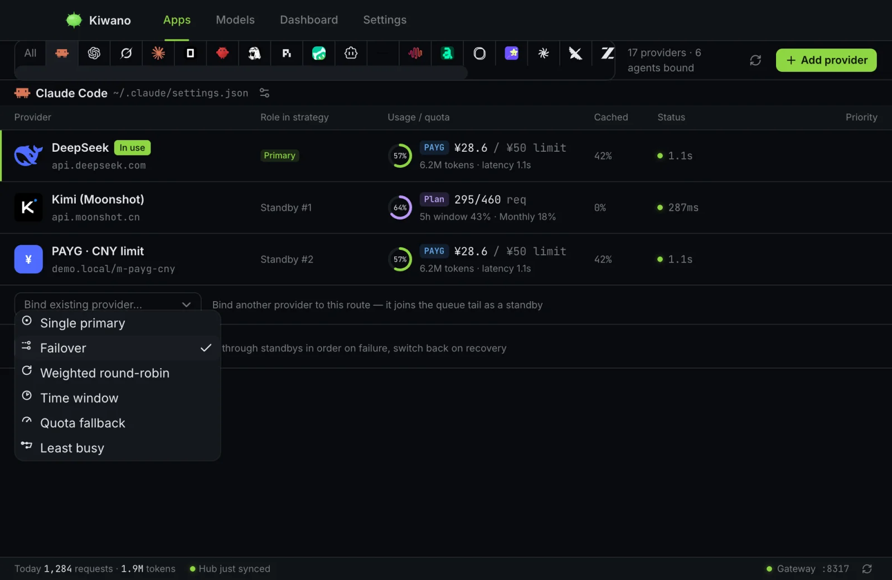

# 策略與限額

每個 Agent 的路由是一個有序候選佇列——綁定到它的供應商們。**策略**決定
下一個請求由哪個候選服務;佇列的其餘部分是本次嘗試中途失敗時的重放順序。
本頁涵蓋策略、花費限額,以及方案用量的讀取方式。

*綁定到 Claude Code 的路由——主用、作為重放順序的備用,以及上方的策略選擇器。*

## 六種策略

| 策略 | 選擇邏輯 | 說明 |
| --- | --- | --- |
| `single` | 永遠是主用。 | 預設值。一個供應商,沒有重放尾巴——但 Agent 超過自身花費限額時,任何策略(包括 `single`)都會拒絕。 |
| `failover` | 依優先順序取第一個斷路器可用的候選。 | 所有斷路器都斷開時,仍會嘗試主用。429 設定供應商自己聲明的短暫暫停;500 計入斷路器。 |
| `roundrobin` | 加權輪轉——**依工作階段**。 | 一段對話保持其供應商,讓它已付費的上游 prompt 快取繼續命中;新工作階段依權重挑選;只有黏著的候選不可用時才重新分配。 |
| `timewindow` | 本機 `HH:MM` 時間窗(可跨午夜)包含當前時間的候選。 | 無命中時回退主用。工作階段黏性與 `roundrobin` 相同。 |
| `quota` | 主用當日用量(請求數或 token 數,讀自用量聚合)超過策略設定裡的門檻後,沉到備用——即 failover 語意。 | 同樣的工作階段黏性:切換發生在*下一段*對話。 |
| `least-busy` | 斷路器可用、目前在途請求數最少的候選。 | 工作階段先排乾(與其他黏性策略一致);優先順序打破平局。 |

兩條跨策略成立的性質:

- **一段對話保持其供應商。** 在黏性策略(`roundrobin`、`timewindow`、
  `quota`)下,切換落在*下一段*對話;已在執行的對話在原地結束,而不是
  重建一個它的供應商已經收過費的 prompt 快取。不帶工作階段識別的請求
  照舊重新挑選。
- **失敗被重放,而不是被退回。** 除 `single` 外的任何策略,中途失敗的
  請求會沿佇列對下一個候選重放,而不是作為錯誤交還給你的 Agent。

## 花費限額(Agent 限額)

每個 Agent 可以按週期設限額——`day`、`weekly`、`monthly`、`yearly` 或
`all`——每個限額由數額和單位組成:請求數(`requests`)、萬 token 區塊
(`wan_tokens`),或一個 **ISO 貨幣代碼**。

貨幣規則是刻意的:限額以該 Agent 的供應商實際計費的貨幣計,而不是你的
顯示偏好貨幣。供應商以別的貨幣計費時,它的花費先按 Hub 匯率*換算*再計入
限額——限額本身永不換算。到達限額後,該 Agent 的新請求被拒絕,理由在 UI
可見,任何策略下都一樣。

## 用量數字從哪來

- **計量用量**來自閘道自己的請求記帳——每條請求的 token 與成本,歸屬到
  服務它的供應商。
- **方案配額**(發布「你的方案用了多少」的訂閱)透過*plan query* 從
  供應商自己的端點讀取。少數目錄條目內建查詢範本(Kimi、智譜個人與團隊、
  MiniMax、ZenMux、OpenCode Go、火山引擎);結果快取五分鐘,可強制重新
  整理。一個供應商可以*按方案計費*卻不支援 plan query——查詢範本才是
  配額環有意義的前提。

## 成本顯示,以及唯一發生換算的地方

成本按各供應商計費的貨幣記錄,並在所有地方按該貨幣顯示——唯獨
**Dashboard** 使用你的偏好顯示貨幣,由 Hub 匯率完成換算。供應商自己的
列永遠不會顯示換算後的數字;列上是 ¥,就意味著供應商以 ¥ 計費。
